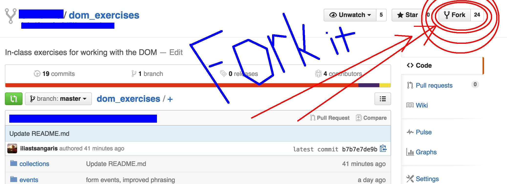
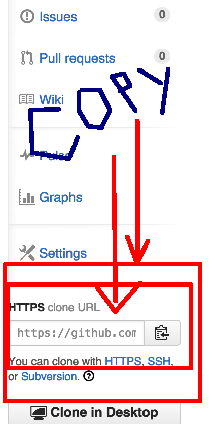

# Using Git

* To begin this homework first fork this repo.

  

* Then clone it by doing the following:
  * Copy the link to **your fork**

     
  * Clone the repo
    
    ```
    git clone <your_copied_url from above>
    ```
  * Then 

    ```bash
    cd dom_exercises
    ```
* Play with the exercises, and when you're ready **push** your changes to GitHub using the following procedure.
  
  * In the `dom_exercises/` folder, not some subfolder, run the following:
    
  ```
  git add . -A
  git commit -m "my homework"
  git push origin master
  ```

* Then submit the link to your fork in the homework submission form.

# DOM Exercises

To get started, fork this repository to make a copy of it on your github account. Next, clone your copy from github onto your computer.  

Navigate into your new `dom_exercises` directory and open the code in sublime with `subl .`. 

Inside `dom_exercises`, there is a directory for each part of the lab. Each directory has its own README.md with instructions. The order for the four parts is:

1. `ids`
2. `forms`
3. `collections`
4. `events` 

Remember to collaborate, do smart searches, and refer back to [lecture notes](https://github.com/sf-wdi-18/notes)!
